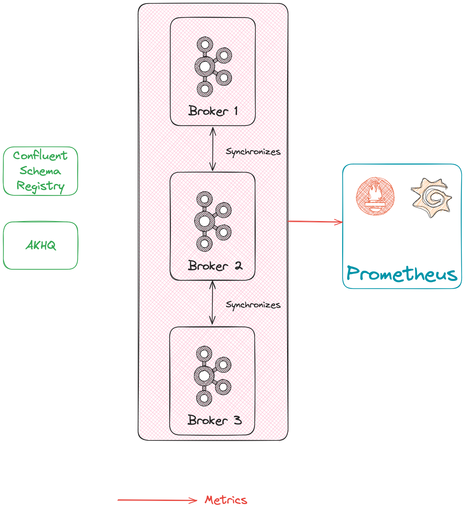

= Kafka cluster kickstarter

The main goal of this repository is to provide a kickstart to deploy a kafka cluster locally.

== Deployed architecture

The following will be deployed :

* 3 Brokers using `docker.io/bitnami/kafka:3.9` and using KRaft (with jmx-exporter)
* 1 Schema registry `docker.io/bitnami/schema-registry:7.8`
* 1 Akhq
* 1 lgtm container with preconfigured dashboard

== Starting the infrastructure

=== Using Podman

[source,shell]
----
podman compose --file Dockercompose.yaml up -d
----

=== Using Docker

[source,shell]
----
docker compose Dockercompose.yaml up -d
----

